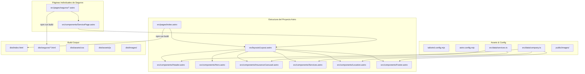
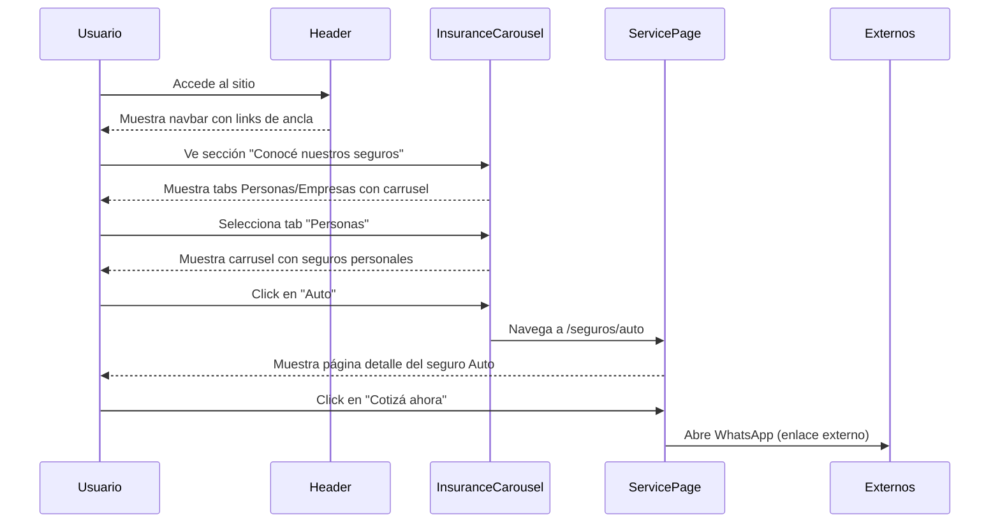
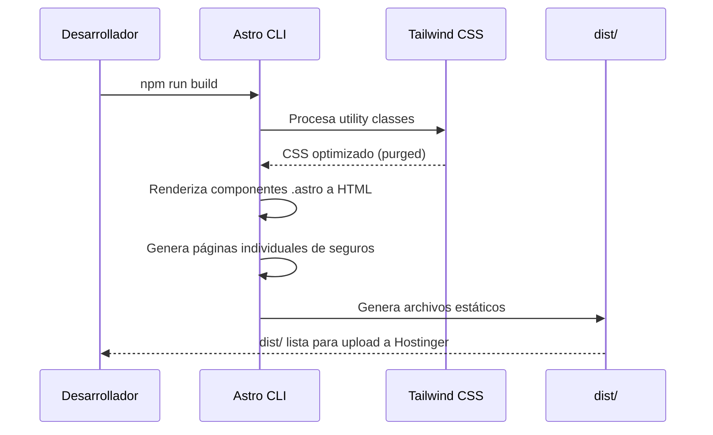

# Documento de Diseño: Laglera Seguros Website

## Descripción General

Este proyecto consiste en un sitio web estático de una sola página (single-page) para "Laglera Asesores de Seguros", una agencia de seguros ubicada en Puerto Madryn, Chubut, Argentina. El sitio se construye con Astro como framework y Tailwind CSS para estilos, optimizado para SEO con datos estructurados JSON-LD, completamente responsivo y listo para despliegue estático en hosting tradicional (Hostinger).

El catálogo de seguros se organiza en dos categorías principales: **Seguros Personas** (coberturas para individuos y familias) y **Seguros Empresa** (coberturas para empresas y actividades comerciales). Cada seguro tiene su propia página individual bajo `src/pages/seguros/` y se muestra agrupado por categoría tanto en el componente `InsuranceCarousel` (homepage) como en el componente `Services` (resumen).

El diseño visual se inspira en la estructura corporativa de Nación Seguros y la funcionalidad/cercanía de Lauro Seguros. La paleta de colores está basada en el logo de la empresa: azul navy oscuro como color primario, blancos y grises claros para fondos, y un azul más claro como acento para CTAs.

La arquitectura es modular con componentes Astro reutilizables (Header, Hero, InsuranceCarousel, Services, Location, Footer), lo que facilita el mantenimiento y futuras expansiones del sitio.

## Arquitectura



## Diagramas de Secuencia

### Flujo de Navegación del Usuario



### Flujo de Build y Despliegue



## Componentes e Interfaces

### Componente: Layout.astro

**Propósito**: Layout principal que envuelve toda la página, incluye meta tags SEO, JSON-LD y carga de fuentes.

```typescript
// Props del Layout
interface LayoutProps {
  title: string;
  description: string;
  canonicalURL?: string;
}
```

**Responsabilidades**:
- Renderizar `<head>` con meta tags SEO (title, description, Open Graph, Twitter Cards)
- Insertar datos estructurados JSON-LD (LocalBusiness)
- Cargar fuentes de Google Fonts (Inter)
- Proveer estructura HTML base con `<slot />` para contenido

### Componente: Header.astro

**Propósito**: Barra de navegación fija con logo, links de ancla y botón CTA destacado.

```typescript
interface NavItem {
  label: string;
  href: string;
}

interface HeaderConfig {
  logo: string;
  navItems: NavItem[];
  ctaButton: {
    label: string;
    href: string;
  };
}
```

**Responsabilidades**:
- Logo a la izquierda
- Links de navegación centrados
- Botón CTA destacado a la derecha
- Menú hamburguesa en mobile
- Comportamiento sticky en scroll

### Componente: Hero.astro

**Propósito**: Banner principal con mensaje de confianza y dos CTAs.

```typescript
interface HeroConfig {
  headline: string;
  subheadline: string;
  primaryCTA: { label: string; href: string; };
  secondaryCTA: { label: string; href: string; };
  backgroundImage?: string;
}
```

**Responsabilidades**:
- Mostrar headline impactante con tipografía grande
- Dos botones CTA (primario y secundario)
- Imagen de fondo con overlay para legibilidad
- Responsive: stack vertical en mobile

### Componente: InsuranceCarousel.astro

**Propósito**: Carrusel interactivo con tabs para mostrar seguros agrupados por categoría (Personas / Empresas).

```typescript
interface InsuranceItem {
  title: string;
  icon: string;   // SVG inline
  href: string;   // Ruta a la página individual, ej: "/seguros/auto"
}

interface InsuranceCarouselConfig {
  personas: InsuranceItem[];   // Seguros para personas
  empresas: InsuranceItem[];   // Seguros para empresas
}
```

**Responsabilidades**:
- Tabs de selección: "Personas" / "Empresas"
- Carrusel horizontal con flechas de navegación (desktop)
- Soporte de swipe/touch (mobile)
- Indicadores de posición (dots)
- Cada item es un link a la página individual del seguro
- Grid estático para la pestaña Empresas

**Catálogo Personas** (10 seguros):
| Seguro | Ruta |
|--------|------|
| Auto | /seguros/auto |
| Moto | /seguros/moto |
| Hogar | /seguros/hogar |
| Comercio | /seguros/integral-comercio |
| Consorcio | /seguros/consorcio |
| Garantía Alquiler | /seguros/garantia-de-alquiler |
| Accidentes Personales | /seguros/accidentes-personales |
| Embarcaciones de Placer | /seguros/embarcaciones |
| Vida | /seguros/vida |
| Travel | /seguros/travel |

**Catálogo Empresas** (11 seguros):
| Seguro | Ruta |
|--------|------|
| Responsabilidad Civil | /seguros/responsabilidad-civil |
| Incendio | /seguros/incendio |
| Todo Riesgo Operativo | /seguros/todo-riesgo-operativo |
| Seguro Técnico | /seguros/seguro-tecnico |
| Flotas Automotores | /seguros/flotas-automotores |
| Transporte | /seguros/transporte |
| Integral de Comercio y de Consorcio | /seguros/integral-comercio-consorcio |
| Caución | /seguros/caucion |
| Vida Colectivo | /seguros/vida-colectivo |
| ART | /seguros/art |
| Travel Corporativo | /seguros/travel-corporativo |

### Componente: Services.astro

**Propósito**: Grid resumen de tarjetas de seguros principales, organizado por categoría, con links a las páginas individuales.

```typescript
type InsuranceCategory = 'personas' | 'empresa';

interface ServiceCard {
  icon: string;
  title: string;
  description: string;
  href: string;
  category: InsuranceCategory;
}

interface ServicesConfig {
  sectionTitle: string;
  categories: {
    personas: { label: string; cards: ServiceCard[]; };
    empresa: { label: string; cards: ServiceCard[]; };
  };
}
```

**Responsabilidades**:
- Título de sección
- Agrupación visual por categoría (Personas / Empresa)
- Grid responsivo de cards (2 cols mobile, 3 cols desktop)
- Cada card muestra icono, título y descripción
- Hover effects sutiles
- Link a la página individual del seguro

### Componente: ServicePage.astro

**Propósito**: Template reutilizable para cada página individual de seguro.

```typescript
interface ServicePageProps {
  title: string;
  description: string;
  headline: string;
  subtitle: string;
  coverages?: string[];
  benefits?: string[];
  plans?: { name: string; details: string[] }[];
  extraInfo?: string;
}
```

**Responsabilidades**:
- Header con navegación de vuelta al home
- Hero con título y subtítulo del seguro
- Secciones opcionales: Coberturas, Beneficios, Planes
- CTA de contacto por WhatsApp
- Footer reutilizado
- Responsive completo

### Componente: Location.astro

**Propósito**: Información de la sucursal con dirección, horarios y mapa.

```typescript
interface LocationConfig {
  sectionTitle: string;
  description: string;
  address: string;
  hours: string;
  mapEmbedURL?: string;
}
```

**Responsabilidades**:
- Título y texto descriptivo
- Mostrar dirección y horario de atención
- Iframe de Google Maps (opcional, con placeholder)
- Layout 2 columnas en desktop (info + mapa)

### Componente: Footer.astro

**Propósito**: Pie de página con información de contacto, legal y redes sociales.

```typescript
interface SocialLink {
  platform: 'facebook' | 'instagram' | 'tiktok' | 'twitter';
  url: string;
  icon: string;
}

interface FooterConfig {
  companyText: string;
  email: string;
  phone: string;
  ssnNumber: string;
  socialLinks: SocialLink[];
  copyright: string;
}
```

**Responsabilidades**:
- 3 columnas: branding, contacto, legal
- Fila inferior: iconos sociales + copyright
- Número de inscripción SSN visible (requisito legal)
- Responsive: stack en mobile

## Modelos de Datos

### Datos de la Empresa (company.ts)

```typescript
export const company = {
  name: "Laglera Asesores de Seguros",
  address: {
    street: "Salta 56",
    city: "Puerto Madryn",
    province: "Chubut",
    country: "Argentina",
    postalCode: "U9120",
    full: "Salta 56, U9120 Puerto Madryn, Chubut, Argentina"
  },
  hours: "Lunes a Viernes 09:00 a 16:00",
  email: "seguros@laglera.com.ar",
  phone: "+54 11 1234 5678",
  ssnRegistration: "85861",
  social: {
    facebook: "https://facebook.com/lagleraseguros",
    instagram: "https://instagram.com/lagleraseguros",
    tiktok: "https://tiktok.com/@lagleraseguros",
    twitter: "https://x.com/lagleraseguros"
  }
} as const;
```

### Datos de Servicios (services.ts) — Estructura Categorizada

```typescript
export type InsuranceCategory = 'personas' | 'empresa';

export interface ServiceCard {
  icon: string;
  title: string;
  description: string;
  href: string;
  category: InsuranceCategory;
}

export const segurosPersonas: ServiceCard[] = [
  {
    icon: "car",
    title: "Auto",
    description: "Protegé tu vehículo con la cobertura más completa del mercado.",
    href: "/seguros/auto",
    category: "personas"
  },
  {
    icon: "motorcycle",
    title: "Moto",
    description: "Cobertura integral para tu moto, desde responsabilidad civil hasta todo riesgo.",
    href: "/seguros/moto",
    category: "personas"
  },
  {
    icon: "home",
    title: "Hogar",
    description: "Asegurá tu casa y tus bienes ante cualquier imprevisto.",
    href: "/seguros/hogar",
    category: "personas"
  },
  {
    icon: "store",
    title: "Comercio",
    description: "Protección integral para tu local comercial y mercadería.",
    href: "/seguros/integral-comercio",
    category: "personas"
  },
  {
    icon: "building",
    title: "Consorcio",
    description: "Cobertura para edificios, partes comunes y responsabilidad del consorcio.",
    href: "/seguros/consorcio",
    category: "personas"
  },
  {
    icon: "key",
    title: "Garantía Alquiler",
    description: "Accedé a tu alquiler sin necesidad de garante propietario.",
    href: "/seguros/garantia-de-alquiler",
    category: "personas"
  },
  {
    icon: "alert",
    title: "Accidentes Personales",
    description: "Cobertura ante lesiones corporales por accidentes en cualquier ámbito.",
    href: "/seguros/accidentes-personales",
    category: "personas"
  },
  {
    icon: "anchor",
    title: "Embarcaciones de Placer",
    description: "Protegé tu embarcación deportiva o de recreo con cobertura a medida.",
    href: "/seguros/embarcaciones",
    category: "personas"
  },
  {
    icon: "heart",
    title: "Vida",
    description: "Garantizá el bienestar de tu familia con un seguro de vida.",
    href: "/seguros/vida",
    category: "personas"
  },
  {
    icon: "plane",
    title: "Travel",
    description: "Viajá tranquilo con asistencia médica y cobertura de equipaje internacional.",
    href: "/seguros/travel",
    category: "personas"
  }
];

export const segurosEmpresa: ServiceCard[] = [
  {
    icon: "shield",
    title: "Responsabilidad Civil",
    description: "Cobertura ante reclamos de terceros por daños derivados de tu actividad.",
    href: "/seguros/responsabilidad-civil",
    category: "empresa"
  },
  {
    icon: "flame",
    title: "Incendio",
    description: "Protección del patrimonio empresarial ante incendio y riesgos aliados.",
    href: "/seguros/incendio",
    category: "empresa"
  },
  {
    icon: "factory",
    title: "Todo Riesgo Operativo",
    description: "Cobertura integral contra daños materiales en tu operación industrial.",
    href: "/seguros/todo-riesgo-operativo",
    category: "empresa"
  },
  {
    icon: "wrench",
    title: "Seguro Técnico",
    description: "Protección para maquinaria, equipos electrónicos y obras en construcción.",
    href: "/seguros/seguro-tecnico",
    category: "empresa"
  },
  {
    icon: "truck",
    title: "Flotas Automotores",
    description: "Gestión centralizada de cobertura para flotas de vehículos empresariales.",
    href: "/seguros/flotas-automotores",
    category: "empresa"
  },
  {
    icon: "package",
    title: "Transporte",
    description: "Cobertura de mercadería en tránsito terrestre, marítimo o aéreo.",
    href: "/seguros/transporte",
    category: "empresa"
  },
  {
    icon: "building-store",
    title: "Integral de Comercio y de Consorcio",
    description: "Póliza combinada para locales comerciales y consorcios de propietarios.",
    href: "/seguros/integral-comercio-consorcio",
    category: "empresa"
  },
  {
    icon: "document",
    title: "Caución",
    description: "Garantías para licitaciones, contratos y cumplimiento de obligaciones.",
    href: "/seguros/caucion",
    category: "empresa"
  },
  {
    icon: "users",
    title: "Vida Colectivo",
    description: "Seguro de vida grupal para empleados y colaboradores de la empresa.",
    href: "/seguros/vida-colectivo",
    category: "empresa"
  },
  {
    icon: "hard-hat",
    title: "ART",
    description: "Aseguradora de Riesgos del Trabajo para cobertura de accidentes laborales.",
    href: "/seguros/art",
    category: "empresa"
  },
  {
    icon: "briefcase-plane",
    title: "Travel Corporativo",
    description: "Asistencia al viajero para empleados en viajes de negocios.",
    href: "/seguros/travel-corporativo",
    category: "empresa"
  }
];

// Array combinado para retrocompatibilidad
export const services: ServiceCard[] = [...segurosPersonas, ...segurosEmpresa];
```

**Reglas de Validación**:
- Cada `ServiceCard` debe tener una `category` válida ("personas" | "empresa")
- El campo `href` debe corresponder a una página existente en `src/pages/seguros/`
- Los iconos se mapean a SVGs inline en los componentes de UI

### Mapeo de Categorías a Páginas Existentes

Páginas ya existentes en `src/pages/seguros/`:
- `auto.astro`, `moto.astro`, `hogar.astro`, `vida.astro`
- `accidentes-personales.astro`, `garantia-de-alquiler.astro`
- `integral-comercio.astro`, `caucion.astro`, `transporte.astro`
- `art.astro`, `mala-praxis.astro`
- `bicicleta-monopatin.astro`, `cartera.astro`, `compra-protegida.astro`
- `robo-en-cajeros.astro`, `tecnologia-protegida.astro`

Páginas nuevas a crear:
- `consorcio.astro`
- `embarcaciones.astro`
- `travel.astro`
- `responsabilidad-civil.astro`
- `incendio.astro`
- `todo-riesgo-operativo.astro`
- `seguro-tecnico.astro`
- `flotas-automotores.astro`
- `integral-comercio-consorcio.astro`
- `vida-colectivo.astro`
- `travel-corporativo.astro`

## Pseudocódigo Algorítmico

### Algoritmo: Generación de JSON-LD para SEO

```typescript
function generateLocalBusinessSchema(company: CompanyData): string {
  const schema = {
    "@context": "https://schema.org",
    "@type": "InsuranceAgency",
    "name": company.name,
    "address": {
      "@type": "PostalAddress",
      "streetAddress": company.address.street,
      "addressLocality": company.address.city,
      "addressRegion": company.address.province,
      "postalCode": company.address.postalCode,
      "addressCountry": "AR"
    },
    "telephone": company.phone,
    "email": company.email,
    "openingHours": "Mo-Fr 09:00-16:00",
    "url": "https://www.laglera.com.ar"
  };
  return JSON.stringify(schema);
}
```

**Precondiciones:**
- `company` contiene todos los campos requeridos
- Las URLs son válidas y accesibles

**Postcondiciones:**
- Retorna JSON válido conforme al schema de Schema.org
- El tipo es "InsuranceAgency" (subtipo de LocalBusiness)
- Los horarios están en formato ISO 8601

### Algoritmo: Renderizado de Servicios por Categoría

```typescript
function renderServicesByCategory(
  services: ServiceCard[],
  activeCategory: InsuranceCategory
): ServiceCard[] {
  return services.filter(s => s.category === activeCategory);
}

function groupServicesByCategory(services: ServiceCard[]): {
  personas: ServiceCard[];
  empresa: ServiceCard[];
} {
  return {
    personas: services.filter(s => s.category === 'personas'),
    empresa: services.filter(s => s.category === 'empresa')
  };
}
```

**Precondiciones:**
- `services` es un array no vacío de ServiceCard válidos
- `activeCategory` es "personas" o "empresa"

**Postcondiciones:**
- Retorna únicamente los servicios de la categoría solicitada
- El orden original dentro de cada categoría se preserva
- Cada servicio aparece en exactamente una categoría

### Algoritmo: Navegación del InsuranceCarousel

```typescript
function initCarousel(items: InsuranceItem[], containerWidth: number): CarouselState {
  const itemWidth = 160 + 24; // w-40 + gap-6
  const itemsPerView = Math.floor(containerWidth / itemWidth);
  const maxIndex = Math.max(0, items.length - itemsPerView);
  
  return { currentIndex: 0, maxIndex, itemsPerView, itemWidth };
}

function navigateCarousel(state: CarouselState, direction: 'prev' | 'next'): CarouselState {
  let newIndex = state.currentIndex;
  if (direction === 'next' && newIndex < state.maxIndex) newIndex++;
  if (direction === 'prev' && newIndex > 0) newIndex--;
  return { ...state, currentIndex: newIndex };
}

function switchTab(newTab: InsuranceCategory): void {
  // Reset carousel position
  // Show/hide corresponding track
  // Toggle navigation arrows visibility based on tab
}
```

**Precondiciones:**
- El DOM está completamente cargado
- Los elementos del carrusel existen en el DOM

**Postcondiciones:**
- El índice del carrusel está siempre dentro de [0, maxIndex]
- Al cambiar de tab, el carrusel se reinicia a posición 0
- Los controles de navegación reflejan el estado actual

### Algoritmo: Navegación Responsiva (Mobile Menu Toggle)

```typescript
function initMobileMenu(): void {
  const menuButton = document.getElementById('menu-toggle');
  const mobileMenu = document.getElementById('mobile-menu');
  
  if (!menuButton || !mobileMenu) return;

  menuButton.addEventListener('click', () => {
    const isOpen = mobileMenu.classList.contains('hidden');
    mobileMenu.classList.toggle('hidden');
    menuButton.setAttribute('aria-expanded', String(isOpen));
  });

  mobileMenu.querySelectorAll('a').forEach(link => {
    link.addEventListener('click', () => {
      mobileMenu.classList.add('hidden');
      menuButton.setAttribute('aria-expanded', 'false');
    });
  });
}
```

**Precondiciones:**
- El DOM está completamente cargado
- Los elementos `menu-toggle` y `mobile-menu` existen

**Postcondiciones:**
- El menú mobile se muestra/oculta al hacer click en el botón
- Los atributos ARIA se actualizan correctamente
- El menú se cierra al seleccionar un link de navegación

**Invariantes:**
- El estado de `aria-expanded` siempre refleja la visibilidad del menú

### Algoritmo: Smooth Scroll para Navegación por Anclas

```typescript
function initSmoothScroll(): void {
  document.querySelectorAll('a[href^="#"]').forEach(anchor => {
    anchor.addEventListener('click', (e: Event) => {
      e.preventDefault();
      const targetId = (anchor as HTMLAnchorElement).getAttribute('href');
      if (!targetId) return;
      
      const target = document.querySelector(targetId);
      if (!target) return;

      const headerOffset = 80;
      const elementPosition = target.getBoundingClientRect().top;
      const offsetPosition = elementPosition + window.scrollY - headerOffset;

      window.scrollTo({
        top: offsetPosition,
        behavior: 'smooth'
      });
    });
  });
}
```

**Precondiciones:**
- Los elementos target referenciados por los href existen en el DOM
- El header tiene una altura fija conocida (80px)

**Postcondiciones:**
- El scroll se realiza suavemente hasta la sección destino
- La sección no queda oculta detrás del header sticky

## Funciones Clave con Especificaciones Formales

### Función: Tailwind Config

```typescript
// tailwind.config.mjs
export default {
  content: ['./src/**/*.{astro,html,js,jsx,md,mdx,svelte,ts,tsx,vue}'],
  theme: {
    extend: {
      colors: {
        primary: '#001F3F',
        'primary-light': '#003366',
        accent: '#0074D9',
        'accent-hover': '#005BB5',
        neutral: {
          50: '#F9FAFB',
          100: '#F3F4F6',
          200: '#E5E7EB',
        }
      },
      fontFamily: {
        sans: ['Inter', 'system-ui', 'sans-serif'],
      }
    }
  },
  plugins: []
};
```

### Función: Astro Config

```typescript
// astro.config.mjs
import { defineConfig } from 'astro/config';
import tailwind from '@astrojs/tailwind';

export default defineConfig({
  integrations: [tailwind()],
  output: 'static',
  site: 'https://www.laglera.com.ar'
});
```

## Ejemplo de Uso

### Estructura de index.astro (Página Principal)

```astro
---
import Layout from '../layouts/Layout.astro';
import Header from '../components/Header.astro';
import Hero from '../components/Hero.astro';
import InsuranceCarousel from '../components/InsuranceCarousel.astro';
import Services from '../components/Services.astro';
import Location from '../components/Location.astro';
import Footer from '../components/Footer.astro';
---

<Layout 
  title="Laglera Asesores de Seguros | Puerto Madryn"
  description="Agencia de seguros en Puerto Madryn. Seguros de auto, hogar, vida, comercio, ART y más para personas y empresas."
>
  <Header />
  <main>
    <Hero />
    <InsuranceCarousel />
    <Services />
    <Location />
  </main>
  <Footer />
</Layout>
```

### Ejemplo: Componente Services con Categorías

```astro
---
import { segurosPersonas, segurosEmpresa } from '../data/services';
---

<section id="seguros" class="py-20 bg-neutral-50 scroll-mt-20">
  <div class="max-w-7xl mx-auto px-4 sm:px-6 lg:px-8">
    <h2 class="text-3xl font-bold text-primary mb-4 text-center">Nuestros Seguros</h2>

    <!-- Seguros Personas -->
    <h3 class="text-xl font-semibold text-primary mb-6">Seguros Personas</h3>
    <div class="grid grid-cols-2 md:grid-cols-3 gap-6 mb-12">
      {segurosPersonas.map((service) => (
        <a href={service.href} class="bg-white rounded-xl border p-6 hover:shadow-md transition-shadow text-center group">
          <div class="w-16 h-16 mx-auto mb-4 bg-accent/10 rounded-full flex items-center justify-center text-accent group-hover:bg-accent group-hover:text-white transition-colors">
            <!-- icono SVG -->
          </div>
          <h4 class="text-lg font-semibold text-primary">{service.title}</h4>
          <p class="text-gray-600 text-sm mt-2">{service.description}</p>
        </a>
      ))}
    </div>

    <!-- Seguros Empresa -->
    <h3 class="text-xl font-semibold text-primary mb-6">Seguros Empresa</h3>
    <div class="grid grid-cols-2 md:grid-cols-3 gap-6">
      {segurosEmpresa.map((service) => (
        <a href={service.href} class="bg-white rounded-xl border p-6 hover:shadow-md transition-shadow text-center group">
          <div class="w-16 h-16 mx-auto mb-4 bg-accent/10 rounded-full flex items-center justify-center text-accent group-hover:bg-accent group-hover:text-white transition-colors">
            <!-- icono SVG -->
          </div>
          <h4 class="text-lg font-semibold text-primary">{service.title}</h4>
          <p class="text-gray-600 text-sm mt-2">{service.description}</p>
        </a>
      ))}
    </div>
  </div>
</section>
```

### Ejemplo: Página Individual de Seguro

```astro
---
// src/pages/seguros/responsabilidad-civil.astro
import ServicePage from '../../components/ServicePage.astro';
---

<ServicePage
  title="Seguro de Responsabilidad Civil"
  headline="Responsabilidad Civil"
  subtitle="Protegé tu empresa ante reclamos de terceros por daños derivados de tu actividad."
  description="Seguro de responsabilidad civil para empresas en Puerto Madryn."
  coverages={[
    "RC comprensiva general",
    "RC profesional",
    "RC por productos elaborados",
    "RC post-trabajos",
    "Daños a bienes de terceros bajo custodia"
  ]}
  benefits={[
    "Defensa legal incluida",
    "Cobertura nacional e internacional",
    "Adaptable a cualquier actividad"
  ]}
/>
```

## Correctness Properties

### Property 1: JSON-LD generation produces valid structured data

*For any* valid company data object, the generated JSON-LD SHALL be valid JSON of type "InsuranceAgency" and SHALL contain all required fields: name, address (PostalAddress), telephone, email, openingHours, and url.

**Validates: Requirements 3.2, 3.3**

### Property 2: Navigation links reference existing DOM elements

*For any* anchor link in the Header navigation, the href value SHALL correspond to an element with a matching id attribute in the rendered page.

**Validates: Requirements 5.1**

### Property 3: External links have security attributes

*For any* link in the rendered HTML that points to an external domain, the link SHALL have `target="_blank"` and `rel="noopener noreferrer"` attributes.

**Validates: Requirements 8.1, 8.2**

### Property 4: All images have descriptive alt text

*For any* `` element in the rendered HTML, the element SHALL have a non-empty `alt` attribute.

**Validates: Requirements 7.2**

### Property 5: No horizontal overflow on supported viewports

*For any* viewport width of 320px or greater, the rendered page SHALL have no horizontal overflow (document.body.scrollWidth <= window.innerWidth).

**Validates: Requirements 4.1**

### Property 6: Mobile menu aria-expanded invariant

*For any* sequence of interactions with the hamburger menu button, the `aria-expanded` attribute value SHALL always equal the visibility state of the mobile menu.

**Validates: Requirements 6.1, 6.3**

### Property 7: Mobile menu closes on link click

*For any* link in the open mobile menu, clicking the link SHALL result in the menu being closed (hidden).

**Validates: Requirements 6.2**

### Property 8: Service cards render all defined services per category

*For any* service defined in `segurosPersonas` or `segurosEmpresa`, the rendered Services section SHALL contain a card displaying that service's title, description, and a link to its individual page, grouped under its respective category heading.

**Validates: Requirements 13.2, 13.3, 13.4, 13.6**

### Property 9: Footer contact links use proper protocols

*For any* email address in company data, the Footer SHALL render it as a `mailto:` link; and for any phone number, the Footer SHALL render it as a `tel:` link.

**Validates: Requirements 15.1**

### Property 10: Footer social links match company data

*For any* social platform URL defined in company.ts, the Footer SHALL contain a corresponding link to that URL.

**Validates: Requirements 15.2**

### Property 11: Color contrast meets WCAG AA

*For any* text element in the rendered page, the contrast ratio between text color and background color SHALL be at least 4.5:1.

**Validates: Requirements 7.1**

### Property 12: Interactive elements have ARIA attributes

*For any* interactive element (button, toggle, expandable) in the rendered HTML, the element SHALL have appropriate ARIA attributes (aria-label, aria-expanded, or visible descriptive text).

**Validates: Requirements 7.3**

### Property 13: Referenced images exist in build output

*For any* image path referenced in the rendered HTML, the corresponding file SHALL exist in the dist/ output directory.

**Validates: Requirements 11.5**

### Property 14: Below-fold images use lazy loading

*For any* image element positioned below the initial viewport fold, the element SHALL have `loading="lazy"` attribute.

**Validates: Requirements 10.3**

### Property 15: Insurance carousel category filtering is exhaustive

*For any* service in the complete catalog, the service SHALL appear in exactly one category tab (Personas XOR Empresa), and switching tabs SHALL display all services belonging to that category.

**Validates: Requirements 16.2, 16.3, 18.5**

### Property 16: Service page links resolve to existing pages

*For any* `href` in the InsuranceCarousel or Services component, the target path SHALL correspond to an existing `.astro` page file under `src/pages/seguros/`.

**Validates: Requirements 18.4**

### Property 17: Carousel resets position on tab switch

*For any* tab switch in the InsuranceCarousel, the carousel position SHALL reset to index 0 regardless of the previous scroll state.

**Validates: Requirements 16.5**

### Property 18: ServicePage renders required content sections

*For any* ServicePage rendered with valid props (title, headline, subtitle, description), the output SHALL contain the title, subtitle, a WhatsApp CTA link, and a navigation link back to the homepage. When optional props (coverages, benefits, plans) are provided, the corresponding sections SHALL be rendered.

**Validates: Requirements 17.1, 17.2, 17.3, 17.6**

### Property 19: Build generates individual insurance pages

*For any* service defined in segurosPersonas or segurosEmpresa, the build output SHALL contain a corresponding HTML file at dist/seguros/{slug}.html matching the service's href.

**Validates: Requirements 11.6**

### Property 20: Category field consistency with array membership

*For any* ServiceCard in the segurosPersonas array, its category field SHALL equal "personas"; and for any ServiceCard in the segurosEmpresa array, its category field SHALL equal "empresa".

**Validates: Requirements 18.5, 2.6**

## Manejo de Errores

### Escenario 1: Google Maps no carga

**Condición**: El iframe de Google Maps falla por red o bloqueo del navegador.
**Respuesta**: Se muestra un div placeholder con la dirección en texto y un link a Google Maps externo.
**Recuperación**: El link externo siempre funciona como fallback.

### Escenario 2: Fuentes externas no cargan

**Condición**: Google Fonts no responde.
**Respuesta**: Se aplica `font-family: system-ui, sans-serif` como fallback definido en Tailwind.
**Recuperación**: Automática via font stack CSS.

### Escenario 3: JavaScript deshabilitado

**Condición**: El usuario tiene JS deshabilitado.
**Respuesta**: La navegación funciona con anclas nativas (sin smooth scroll). El menú mobile se muestra expandido por defecto. El carrusel muestra todos los items en grid sin interactividad.
**Recuperación**: El contenido es completamente accesible sin JS (sitio estático).

### Escenario 4: Página de seguro no encontrada

**Condición**: Un link del catálogo apunta a una página que aún no fue creada.
**Respuesta**: Astro genera un 404 en build si la ruta no existe.
**Recuperación**: Crear la página faltante usando el template ServicePage.astro.

## Estrategia de Testing

### Testing de Unidad

- Verificar que `generateLocalBusinessSchema()` produce JSON-LD válido
- Verificar que los datos de `company.ts` contienen todos los campos requeridos
- Verificar que las URLs de navegación coinciden con IDs existentes
- Verificar que `segurosPersonas` y `segurosEmpresa` contienen los seguros esperados
- Verificar que todos los `href` en services.ts corresponden a páginas existentes

### Testing con Propiedades (Property-Based Testing)

**Librería**: No aplica directamente (sitio estático), pero se pueden usar herramientas de auditoría:
- Lighthouse para SEO score ≥ 90
- axe-core para accesibilidad (0 violations)
- Validador de Schema.org para JSON-LD
- Script de verificación de rutas internas

### Testing de Integración

- `npm run build` ejecuta sin errores
- Los archivos generados en `dist/` incluyen `index.html` con todo el contenido
- Todas las páginas de seguros se generan correctamente en `dist/seguros/`
- El HTML generado pasa validación W3C
- Todas las imágenes referenciadas existen en `dist/`
- Los links internos (anclas y rutas) apuntan a destinos válidos

## Consideraciones de Performance

- **Imágenes**: Usar formatos modernos (WebP/AVIF) con fallbacks, lazy loading para imágenes below-the-fold
- **CSS**: Tailwind hace purge automático, resultando en CSS minimal (~10-15KB)
- **Fuentes**: Precargar la fuente Inter con `<link rel="preload">`, usar `font-display: swap`
- **Build estático**: Sin JavaScript en runtime excepto para menú mobile, smooth scroll y carrusel (~3KB)
- **Páginas individuales**: Cada página de seguro es HTML estático independiente, carga instantánea
- **Target**: Lighthouse Performance score ≥ 90

## Consideraciones de Seguridad

- **Links externos**: Todos con `rel="noopener noreferrer"` para prevenir tabnapping
- **Email obfuscation**: Considerar codificar el email para reducir spam de bots
- **CSP Headers**: Configurar Content-Security-Policy para limitar fuentes de scripts/estilos (configurar en hosting)
- **No hay formularios**: Al ser estático sin backend, no hay vectores de inyección SQL/XSS en forms
- **Iframe Maps**: Restringir con `sandbox` attribute apropiado

## Dependencias

| Dependencia | Versión | Propósito |
|---|---|---|
| astro | ^4.x | Framework de generación estática |
| @astrojs/tailwind | ^5.x | Integración Tailwind con Astro |
| tailwindcss | ^3.x | Framework de utilidades CSS |
| @fontsource/inter | ^5.x | Fuente Inter (self-hosted, mejor performance) |

### Estructura de Archivos Final

```
laglera-seguros-website/
├── public/
│   ├── favicon.svg
│   └── images/
├── src/
│   ├── components/
│   │   ├── Header.astro
│   │   ├── Hero.astro
│   │   ├── InsuranceCarousel.astro
│   │   ├── Services.astro
│   │   ├── ServicePage.astro
│   │   ├── Location.astro
│   │   └── Footer.astro
│   ├── data/
│   │   ├── company.ts
│   │   └── services.ts
│   ├── layouts/
│   │   └── Layout.astro
│   └── pages/
│       ├── index.astro
│       └── seguros/
│           ├── auto.astro
│           ├── moto.astro
│           ├── hogar.astro
│           ├── consorcio.astro
│           ├── garantia-de-alquiler.astro
│           ├── accidentes-personales.astro
│           ├── embarcaciones.astro
│           ├── vida.astro
│           ├── travel.astro
│           ├── responsabilidad-civil.astro
│           ├── incendio.astro
│           ├── todo-riesgo-operativo.astro
│           ├── seguro-tecnico.astro
│           ├── flotas-automotores.astro
│           ├── integral-comercio.astro
│           ├── integral-comercio-consorcio.astro
│           ├── transporte.astro
│           ├── caucion.astro
│           ├── vida-colectivo.astro
│           ├── art.astro
│           └── travel-corporativo.astro
├── astro.config.mjs
├── tailwind.config.mjs
├── tsconfig.json
└── package.json
```
